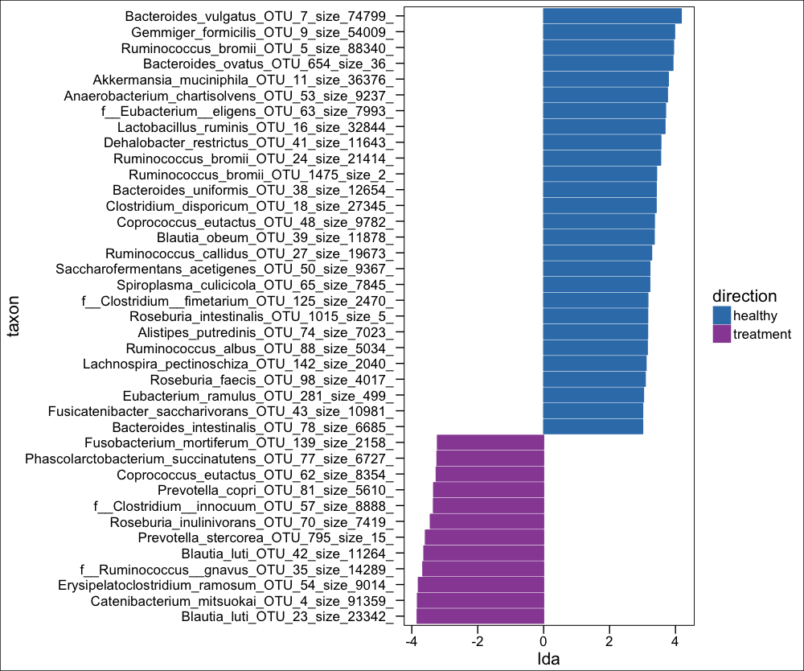

# HRZE and the gut microbiome

This tutorial is a walkthrough of the data analysis from:

Antibiotic treatment for Tuberculosis induces a profound dysbiosis of the microbiome that persists long after therapy is completed


Scientific Reports 7, Article number: 10767 (2017)


[doi: 10.1038/s41598-017-10346-6](https://www.nature.com/articles/s41598-017-10346-6)


It shows how to take microbiome data and reproduce the figures from this paper.

## Part 1: Load packages and import 16S microbiome data into R from uparse pipeline

```{r}
setwd("~/Desktop/uparse_july/")

rm(list=ls())
library(plyr);library(ggtree);library(phyloseq);library(ggplot2);library(scales);library(grid)
library(Hmisc);library(gridExtra);library(scales);library(stringr);library(logistf)
library(coxphf);library(reshape2);library(ifultools);library(car);library(vegan)
library(gdata);library(chron);library(data.table);library(tidyr) #imports tibble
library(ggplot2);library(yingtools2);library(gridExtra);library(lubridate);library(dplyr)
library("pheatmap");library("RColorBrewer");library("genefilter");library(ggthemes)
```
### Give priority to specific functions for annoying namespace reasons
```{r}
select <- dplyr::select
summarize <- dplyr::summarize
rownames_to_column <- tibble::rownames_to_column
```

### Necessary uparse pipeline output files for downstream 16S data analysis
```{r}
#edit the $PATH to these files
biom.file <- "~/Desktop/uparse_july/total.8.otu-tax.biom"
seq.file <- "~/Desktop/uparse_july/total.5.repset.fasta"
tax.file <- "~/Desktop/uparse_july/total.5.repset.fasta.blastn.refseq_rna.txt"
tree.file <- "~/Desktop/uparse_july/total.10.tree"

biom <- import_biom(biom.file)
seq <- import_qiime(refseqfilename=seq.file)
tree <- yingtools2::read.tree.uparse(tree.file)

#make tax object with BLAST names (skip this step to assign GreenGenes names instead)
tax <- yingtools2::read.blastn.file(tax.file) %>% set.tax()
```

### Import and setup sample data (metadata for each person in the study)
```{r}
data.file <- "TBRU_Metadata_May2017.csv"
data <- read.csv(data.file,na.strings=c("N/A","99999")) %>% mutate(sample=gsub("\\-",".",sample))
samp <- data %>% data.frame()

#fix some name issues in the biom file to make sample_names(biom) consistent
sample_names(biom) <- gsub("..pool749","",sample_names(biom))
sample_names(biom) <- gsub("\034","",sample_names(biom))
```

### Merge all data together to create the final phyloseq object
```{r}
phy <- merge_phyloseq(biom,seq,tree)
tax_table(phy) <- tax
sample_data(phy) <- samp %>% set.samp()
```
## Part 2: Subset phyloseq data and run DESeq data normalization
```markdown
#IGRA positive, only community cohort vs treatment
phyIGRA_pos_treatment <- subset_samples(phy,!is.na(IGRA) & IGRA!="negative") #can change this first variable to increase contorl sample size by including all IGRA- people, change "negative" to ""
phyIGRA_pos_treatment <- subset_samples(phyIGRA_pos_treatment,!is.na(IGRA) & IGRA!="")
phyIGRA_pos_treatment <- subset_samples(phyIGRA_pos_treatment,!is.na(TB_status) & TB_status!="cured")
phyIGRA_pos_treatment <- subset_samples(phyIGRA_pos_treatment,!is.na(TB_status) & TB_status!="")
phyIGRA_pos_treatment <- subset_samples(phyIGRA_pos_treatment,!is.na(Group6_TB_category) & Group6_TB_category!="family_contact")
phyIGRA_pos_treatment <- subset_samples(phyIGRA_pos_treatment,age < 33)
```
### View the Family-level distribution of taxa between the two groups
```{r}
assignCols <- function(names,selection) {
mymap<-list()
availableCols <-c("#000000", "#FFFF00", "#1CE6FF", "#FF34FF", "#FF4A46", "#008941", "#006FA6", "#A30059",
"#FFDBE5", "#7A4900", "#0000A6", "#63FFAC", "#B79762", "#004D43", "#8FB0FF", "#997D87",
"#5A0007", "#809693", "#FEFFE6", "#1B4400", "#4FC601", "#3B5DFF", "#4A3B53", "#FF2F80",
"#61615A", "#BA0900", "#6B7900", "#00C2A0", "#FFAA92", "#FF90C9", "#B903AA", "#D16100",
"#DDEFFF", "#000035", "#7B4F4B", "#A1C299", "#300018", "#0AA6D8", "#013349", "#00846F",
"#372101", "#FFB500", "#C2FFED", "#A079BF", "#CC0744", "#C0B9B2", "#C2FF99", "#001E09",
"#00489C", "#6F0062", "#0CBD66", "#EEC3FF", "#456D75", "#B77B68", "#7A87A1", "#788D66",
"#885578", "#FAD09F", "#FF8A9A", "#D157A0", "#BEC459", "#456648", "#0086ED", "#886F4C",
"#34362D", "#B4A8BD", "#00A6AA", "#452C2C", "#636375", "#A3C8C9", "#FF913F", "#938A81",
"#575329", "#00FECF", "#B05B6F", "#8CD0FF", "#3B9700", "#04F757", "#C8A1A1", "#1E6E00",
"#7900D7", "#A77500", "#6367A9", "#A05837", "#6B002C", "#772600", "#D790FF", "#9B9700",
"#549E79", "#FFF69F", "#201625", "#72418F", "#BC23FF", "#99ADC0", "#3A2465", "#922329",
"#5B4534", "#FDE8DC", "#404E55", "#0089A3", "#CB7E98", "#A4E804", "#324E72", "#6A3A4C",
"#83AB58", "#001C1E", "#D1F7CE", "#004B28", "#C8D0F6", "#A3A489", "#806C66", "#222800",
"#BF5650", "#E83000", "#66796D", "#DA007C", "#FF1A59", "#8ADBB4", "#1E0200", "#5B4E51",
"#C895C5", "#320033", "#FF6832", "#66E1D3", "#CFCDAC", "#D0AC94", "#7ED379", "#012C58")
mymap[[1]]<-rev(availableCols[match(intersect(names,selection),names)])
mymap[[2]]<-intersect(names,selection)
mymap
};

#function to make a tax plot faceted by whatever variable
plot.tax <- function(phyloseq, variable){
t <- get.otu.melt(phyIGRA_pos_treatment) %>% arrange(Kingdom, Phylum, Class, Order, Family, Genus, Class) %>%
mutate(TB_status = factor(TB_status,levels = unique(TB_status))) %>% group_by(sample) %>%
arrange(TB_status) %>% mutate(cum.pct = cumsum(pctseqs),
y.text = (cum.pct + c(0, cum.pct[-length(cum.pct)]))/2) %>%
ungroup() %>% dplyr::select(-cum.pct)
g <- ggplot() + geom_bar(data = t, aes_string(x = "sample",
y = "pctseqs", fill = "Order"), stat = "identity",position = "fill") +
theme(legend.position = "bottom") + facet_grid(~TB_status,scales="free",space="free")
g
return(g)
}

t <- get.otu.melt(phyIGRA_pos_treatment) %>% arrange(Kingdom, Phylum, Class, Order, Family, Genus, Class) %>%
mutate(TB_status = factor(TB_status,levels = unique(TB_status))) %>% group_by(sample) %>%
arrange(TB_status) %>% mutate(cum.pct = cumsum(pctseqs),
y.text = (cum.pct + c(0, cum.pct[-length(cum.pct)]))/2) %>%
ungroup() %>% dplyr::select(-cum.pct) %>% as.data.frame()

#show the Family level in the plot
mycol <- assignCols(unique(t$Family),unique(t$Family))

barplot <- ggplot() + geom_bar(data = t, aes_string(x = "sample", y = "pctseqs", fill = "Family"),stat = "identity",position = "fill") +
facet_grid(~TB_status,scales="free",space="free") +
theme(legend.position = "bottom", axis.title.x=element_blank(),axis.text.x=element_blank(),axis.ticks.x=element_blank()) +
theme(legend.text = element_text(size = 14)) +
scale_fill_manual(values = mycol[[1]],breaks=mycol[[2]])
barplot
```


### Load the DESeq2 package, make taxa names more friendly
Downstream plotting of log2 differential abundance data from the DESeq output is made easier when the Species name and the specific OTU number are merged, since multiple OTUs can have the same name
```{r}
library("DESeq2")
phy_DESeq <- phyIGRA_pos_treatment

t <- get.tax(phy_DESeq) %>% mutate(PhySpec=paste(Species,otu))
taxa_names(phy_DESeq) <- t$PhySpec
taxa_names(phy_DESeq) <- gsub(" ","_",taxa_names(phy_DESeq))
taxa_names(phy_DESeq) <- gsub("=","_",taxa_names(phy_DESeq))
taxa_names(phy_DESeq) <- gsub(";","_",taxa_names(phy_DESeq))
```

### Check the variance of OTU abundances
This plot tells you that most of the OTUs do not vary much from the raw sequencing data (this is a property of zero inflated data), but some have rather high variance. DESeq will attempt to normalize this variance with respect to a particular sample variable.
```{r}
hist(log10(apply(otu_table(phy_DESeq), 1, var)), xlab = "log10(variance)", main = "A large fraction of OTUs have very low variance")
```


### Convert the phyloseq object to DESeq object, normalize with respect to TB status, and plot the results
```{r}
dig <- phyloseq_to_deseq2(phy_DESeq, ~ TB_status) #replace this with any sample variable(s)

#calculate geometric mean
gm_mean <- function(x, na.rm=TRUE){
exp(sum(log(x[x > 0]), na.rm=na.rm) / length(x))
}
geoMeans <- apply(counts(dig), 1, gm_mean)
dig <- estimateSizeFactors(dig, geoMeans = geoMeans)
dig <- estimateDispersions(dig)
dig <- DESeq(dig,fitType= "local")

res <- results(dig)
#res$pfdr <- p.adjust(res$pvalue,method="fdr")
res <- res[order(res$padj, na.last=NA), ]
alpha <- 0.05
sigtab <- res[(res$padj < alpha), ]
sigtab <- cbind(as(sigtab, "data.frame"), as(tax_table(phy_DESeq)[rownames(sigtab), ], "matrix"))
head(sigtab) #view the data

posigtab <- sigtab[sigtab[, "log2FoldChange"] > 1, ]
posigtab <- posigtab[, c("baseMean", "log2FoldChange", "lfcSE", "padj", "Phylum", "Class", "Family", "Genus")]

library("ggplot2")
theme_set(theme_bw())
sigtabgen <- subset(sigtab, !is.na(Genus))
sigtabgen <- subset(sigtab, !is.na(Phylum))
#Reorder the data to display the genus
x <- tapply(sigtabgen$log2FoldChange, sigtabgen$Genus, function(x) max(x))
x <- sort(x, TRUE)
sigtabgen$Genus <- factor(as.character(sigtabgen$Genus), levels=names(x))

phylumcolors <- c("hotpink","brown","lightblue","purple")
ggplot(sigtabgen, aes(x = Genus, y = log2FoldChange, color = Phylum)) + geom_point(size = 6) +
theme(axis.text.x = element_text(angle = -45, hjust = 0, vjust = 1)) +
theme(axis.text=element_text(size=12,face="bold"),legend.text=element_text(size=12))
```
This plot shows the log2 fold change between IGRA+ people and people on HRZE antibiotic treatment for Tuberculosis. Most of the OTUs fall below zero because they are depleted in people taking antibiotics. Some OTUs are increased however, potentially taking advantage of the altered ecosystem of the gut while taking antibiotics.


## Part 3: Analyze data with LEfSe
##### LEfSe website: [LEfSe](https://bitbucket.org/biobakery/biobakery/wiki/lefse)

### Check the $PATH in RStudio to make sure LEfSe Python scripts are there
```{r}
system2("echo",args = "$PATH")
#RStudio should inherit the system path if it is opened at the command line with "open -a RStudio"
```

```{r}
#acquire sample data from subsetted phyloseq object and set LEfSe parameters
phy.lefse <- phy_DESeq
results_folder <- "~/Desktop/uparse_july/"
class <- "TB_status"
subclass<-FALSE
subject<-"sample"
anova.alpha<-0.05 #this is the important p value
wilcoxon.alpha<-0.05
lda.cutoff<-3.0
wilcoxon.within.subclass <- TRUE
one.against.one <- T
mult.test.correction <- 0
make.lefse.plots <- FALSE
by_otus <- FALSE
#
sample.data <- phyloseq::sample_data(phy.lefse) %>% data.frame(stringsAsFactors = FALSE)
sample.data$sample <- rownames(sample.data)
#
keepvars <- c("sample","TB_status")
keepvars <- unique(keepvars[!is.na(keepvars)])
lefse.samp <- sample.data[, keepvars]
#
sample0 <- t(lefse.samp) %>% as.matrix()
colnames(sample0) <- sample0[1,]
sample0 <- as.data.frame(sample0)
#
data0 <- otu_table(phy.lefse) %>% as.data.frame()
data1 <- data0 %>% as.data.table(keep.rownames=T)
sample1 <- sample0 %>% as.data.table(keep.rownames=T)
common <- intersect(colnames(data1), colnames(sample1))
pre.lefse <- rbind(sample1, data1,fill=T) %>% t() %>% na.omit() %>% t()

#writes table for LEfSe
write.table(pre.lefse,file =paste(results_folder,"lefse.txt",sep=""),sep = "\t",row.names = FALSE,col.names = FALSE,quote = FALSE)
```
```{r}
opt.class <- paste("-c", which(keepvars %in% class))
opt.subclass <- ifelse(is.na(subclass), "", paste("-s", which(keepvars %in%
subclass)))
opt.subject <- ifelse(is.na(subject), "", paste("-u", which(keepvars %in%
subject)))
format.command <- paste(paste("format_input.py ",results_folder,"lefse.txt ",results_folder,"lefse.in",sep=""),
opt.class, opt.subject, "-o 1000000")
format.command
#"format_input.py ~/Desktop/uparse_july/lefse.txt ~/Desktop/uparse_july/lefse.in -c 2 -u 1 -o 1000000"
system(format.command)
```
```{r}
lefse.command <- paste(paste("~/miniconda2/bin/python ~/lefse/run_lefse.py ",results_folder,"lefse.in " ,results_folder, "lefse.res",sep=""),
"-a", anova.alpha, "-w", wilcoxon.alpha, "-l", lda.cutoff,
"-e", as.numeric(wilcoxon.within.subclass), "-y", as.numeric(one.against.one),
"-s", mult.test.correction)
lefse.command
#"~/miniconda2/bin/python ~/lefse/run_lefse.py ~/Desktop/uparse_july/lefse.in ~/Desktop/uparse_july/lefse.res -a 0.05 -w 0.05 -l 3 -e 1 -y 1 -s 0"
system(lefse.command) #this will print out the number of significant OTUs (make sure it's not 0)
```
```{r}
lefse.out <- read.table(paste(results_folder,"lefse.res",sep=""), header = FALSE, sep = "\t")
names(lefse.out)<-c("taxon","log.max.pct","direction","lda","p.value")
(lefse.out<-na.omit(lefse.out))
```
```{r}
Palette_LTBI_treatment <- c("#377eb8","#984ea3","pink","blue") #color palette for plots
if(length(unique(lefse.out$direction))<3){
lefse.out$lda[lefse.out$direction==unique(lefse.out$direction)[1]] <-
-1*lefse.out$lda[lefse.out$direction==unique(lefse.out$direction)[1]]
}
lefse.out$taxon<-factor(lefse.out$taxon,levels=lefse.out$taxon[order(lefse.out$lda)])
g1<-ggplot(data=lefse.out,aes(x=taxon,y=lda,color=direction,fill=direction))+
geom_bar(stat="identity")+
coord_flip()+
theme_base()
if(length(unique(lefse.out$direction))<3){
g1<-g1+scale_color_manual(values=c(Palette_LTBI_treatment))+
scale_fill_manual(values=c(Palette_LTBI_treatment))
}
print(g1)
```
The abscissa shows the linear discriminant analysis (LDA) score for each OTU—a higher score means that the OTU is more important according to LEfSe to discriminate between IGRA+ and HRZE individuals:


```{r}
ltk<-as.character(lefse.out$taxon)
phy_ra_ltk<-prune_taxa(ltk,phy.lefse)
phy_ra_ltk_m<-psmelt(phy_ra_ltk)

phy_ra_ltk_m$OTU<-factor(phy_ra_ltk_m$OTU, levels=lefse.out$taxon[order(lefse.out$lda)])

g2<-ggplot(phy_ra_ltk_m,aes(x=OTU,
y=Abundance,color=TB_status,
fill=TB_status))+
geom_boxplot(position=position_dodge(),
colour="black", # Use black outlines,
size=.3,alpha=0.5) +      # Thinner lines
theme_base()+  xlab("")+  coord_flip() +
scale_y_continuous(limits = c(0,200))
if(length(unique(lefse.out$direction))<3){
g2<-g2+scale_color_manual(values=c(Palette_LTBI_treatment))+
scale_fill_manual(values=c(Palette_LTBI_treatment))
}
print(g2)
```
Using ggplot's geom_boxplot function, we can plot the most significantly differentially changed OTUs for LTBI vs HRZE people. I left the outliers in just to highlight that they are there, although we removed them for the actual paper for aesthetic purposes:


## Part 4: Principal Coordinates Analysis

```{r}
phy_ord <- ordinate(phyIGRA_pos_treatment, "NMDS", "bray")
p <- plot_ordination(phyIGRA_pos_treatment,phy_ord, color="TB_status")
p + geom_point(size=4)

Palette_LTBI_treatment <- c("#377eb8","#984ea3") #set the color palette

phy_ord <- ordinate(phyIGRA_pos_treatment, "NMDS", "bray")
p <- plot_ordination(phyIGRA_pos_treatment,phy_ord, color="TB_status")
p + geom_point(size=4) + theme(legend.text = element_text(size=15),
axis.title.x = element_text(size=20),
axis.title.y = element_text(size=20),
axis.text.x = element_text(size=15),
axis.text.y = element_text(size=15)) +
scale_colour_manual(values=Palette_LTBI_treatment)
```
The Nonmetric Multidimensional Scaling (NMDS) output does not give traditional PCA % variance values, but is good for count data, and performs well separating people on HRZE and healthy LTBI controls:


## Part 5: Making a heatmap of the most differentially abundant OTUs
Heatmaps are my personal favorite way of looking at this type of data. Ideally one would put much more information than just a heatmap into a single figure, but let's start with making a heatmap of just the top 40 most differentially abundant OTUs, and then perform unsupervised hierarchical clustering.
```{r}
rst <- varianceStabilizingTransformation(dig, blind=FALSE,fitType = "parametric")
sampleDists <- dist( t( assay(rst) ) )
sampleDists
topVarGenes <- head(order(rowVars(assay(rst)),decreasing=TRUE),40)
mat <- assay(rst)[ topVarGenes, ]
mat <- mat - rowMeans(mat)
rst$days_ON_HRZE <- as.numeric(rst$days_ON_HRZE)
df <- as.data.frame(colData(rst)[,c("TB_status","days_ON_HRZE","age","sex")]) #"days_ON_HRZE","TB_status"
pheatmap(mat, annotation_col=df,clustering_distance_rows = "correlation",
clustering_method = "ward.D2",show_colnames = F)
```


## Part 6: Making a phylogenetic tree with relative OTU abundance in a heatmap
People always ask me about individuals on treatment (HRZE) and what effect(s) there are on the Actinobacteria in the microbitoa. Interestingly, the major effects are in the Firmicutes, and as a Phylum, the Actinobacteria are largely untouched, with the exception of a species of Bifidobacterium. The plot below takes the phylogenetic tree of Actinobacteria (generated from make_phylogeny.py) and maps the relative abundance of each OTU on the tree in a heatmap.

```{r}
p_actino <- subset_samples(phy,!is.na(IGRA) & IGRA!="")
p.species <- subset_taxa(p_actino, Phylum=="Actinobacteria")

tr <- phy_tree(p.species)
spec <- as.data.frame(get.tax(p.species))
gt <- ggtree(tr, branch.length = "y") %<+% spec
gd <- gt$data

tt <- get.otu.melt(p.species,filter.zero=FALSE)%>%left_join(select(gd,otu=label,x,y),by="otu") %>%
arrange(TB_status) %>% mutate(sample2=factor(sample,levels=unique(sample)),
col=as.numeric(sample2),x.col=scales::rescale(col,to=c(1.3,2)))

tt$TB_status<-factor(tt$TB_status,levels=c("cured","treatment","healthy"))
Palette_actino <- c("#e7298a","#984ea3","#377eb8")


g1 <- gt + geom_tippoint(data=gd$istip,aes(color=Genus),size=3) +
geom_text(data=gd$istip,aes(label=Genus,x=x+0.001),hjust=-0.1,check_overlap = F) +
geom_tile(data=tt,aes(x=x.col,y=y,fill=TB_status,alpha=pctseqs),position="dodge") +
scale_alpha_continuous(trans=log_epsilon_trans(0.00001),aes(show.legend=Relative_Abundance)) +
theme(legend.position="right")
g1 + scale_fill_manual(values=Palette_actino)
```


